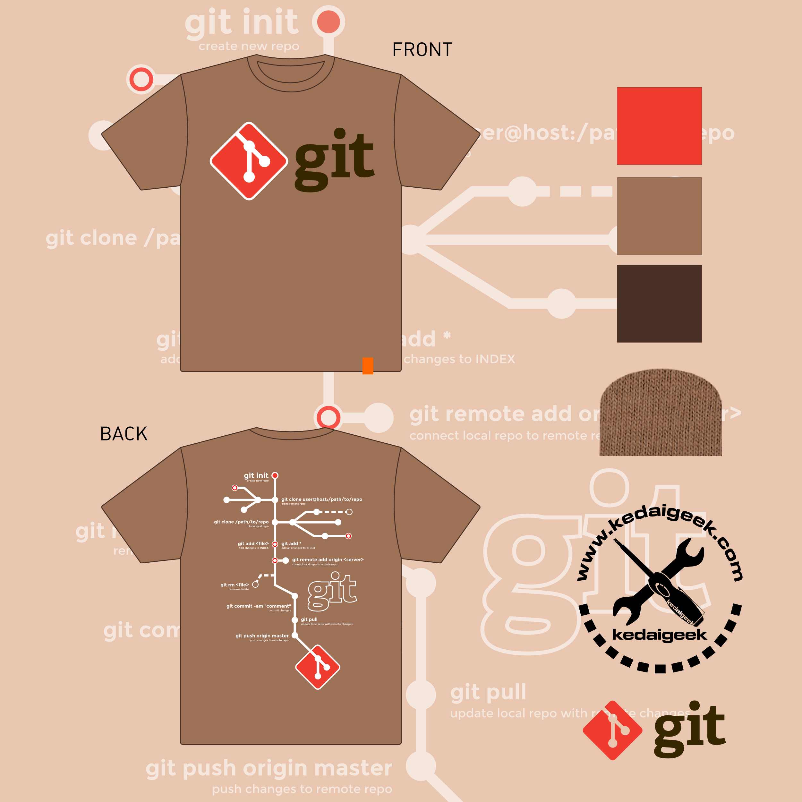

# TempahTeeGit

Ini adalah repo untuk tempahan t-shirt Git dari Kedaigeek.
Sengaja buat macam ni supaya korang prektis Git ni... hahaha...

Ini design baju Git yang dicadangkan kepada taiko besar LinuxMalaysia Malaysia untuk layan 
sendiri-sendiri bersama kawan-kawan yang memahami menatang apa Git ni... 
Siapa yang faham dan berminat nak beli t-shirt ni, 
sila buat tempahan pre-order sekarang. Limited Edition. Tiada reprint akan dibuat.

Harga kenkawan, RM40 aje cukup ah. 
T-shirt Gildan Premium. 
Saiz dari S hingga 2XL sahaja.

Jangan tunggu last minit, nanti tertinggal bas. 
Tempahan ditutup Selasa depan, 30 Jun 2015 
sebab aku nak pakai baju ni pada hari kursus Git 11 Julai 2015 tu... 
baru la terasa poyo sikit semangatnya... hahahaha...

## INGAT!! Tempahan akan ditutup pada hari Selasa, 30 Jun 2015

Cara tempahan dari repo ni...
 1. Fork (menggarfu) repo ni.
 2. Update nama sendiri dalam file senarai tu
 3. Push balik kat repo korang dalam github
 4. Buat PULL REQUEST supaya aku update

tu aje... terima kasih!

